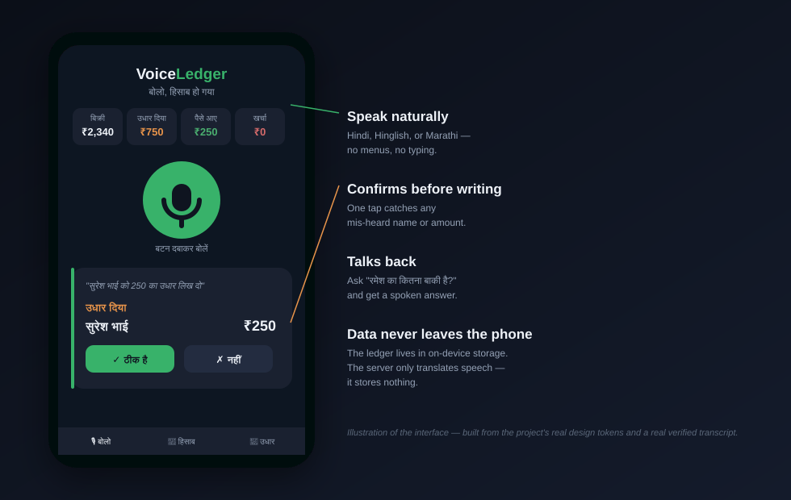
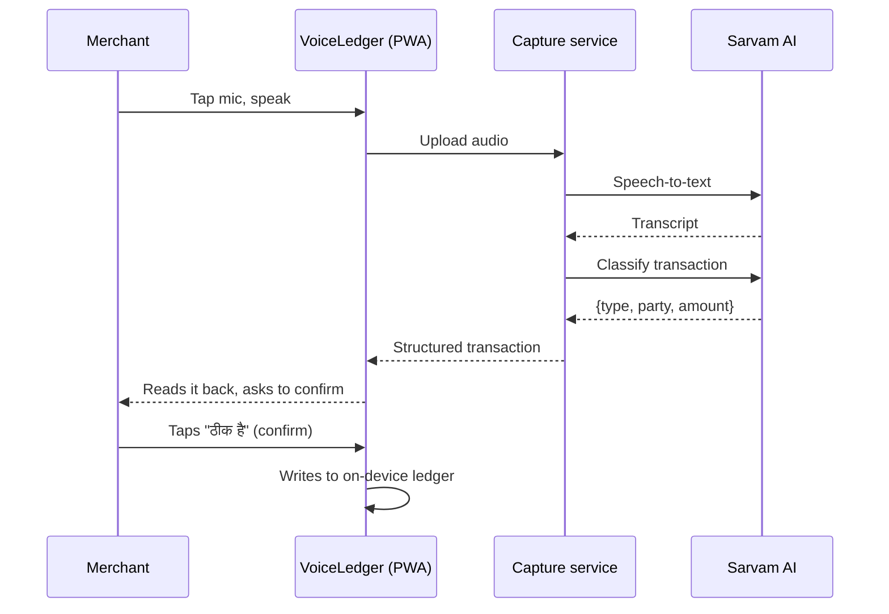

<div align="center">

# VoiceLedger

### बोलो, हिसाब हो गया — *speak, and your books are done*

A voice-first digital ledger for India's small merchants — kirana shops, tea stalls,
tailors, vegetable carts. Speak a transaction in Hindi, Hinglish, or Marathi.
Get it back structured, confirmed, and spoken aloud. No typing. No app store.
No data leaving the phone.

[](LICENSE)
[](server/package.json)
[](#contributing)

</div>



## The problem

Tens of millions of small merchants in India keep their accounts — sales, expenses,
and *udhaar* (credit given to regular customers) — in a paper notebook. Digital
ledger apps exist, but nearly all of them are tap-and-type interfaces. That's a real
barrier for anyone who isn't comfortable typing quickly in any script, which is a
large share of the people these apps are meant to serve.

Everyone in this market can speak. VoiceLedger is built around that instead of
around a keyboard.

## How it works

You tap one button and say something like:

> "Ramesh ko paanch sau ka saman diya, udhaar" — *gave Ramesh goods worth 500, on credit*



The confirmation step matters: speech recognition isn't perfect, so nothing is
written until you've heard it read back and tapped once to approve it.

You can also just ask questions:

> "रमेश का कितना उधार बाकी है?" → *"रमेश का ₹500 बाकी है"* (spoken aloud)

## Features

- **Speak naturally** — Hindi, Hinglish, and Marathi, in the way people actually talk, not fixed command phrases
- **Confirms before writing** — every parsed transaction is shown and read back before it touches the ledger
- **Talks back** — ask for a balance or a daily total and get a spoken answer, not just a screen
- **Local-first ledger** — all transaction data lives in the browser's on-device storage; the server only turns speech into structured JSON and keeps nothing
- **Installs like an app, isn't one** — it's a PWA behind a shareable link or QR code, so there's no app store review and no multi-hundred-megabyte download on a storage-constrained phone
- **Zero setup for the merchant** — no account, no OTP, no sign-up flow to abandon

## Why this, why now

Voice recognition for Indian languages has only recently crossed a real accuracy
threshold for noisy, code-mixed, real-world speech — the kind spoken on an actual
shop floor, not read off a script in a quiet studio. That's the gap this project
is built on: pairing that capability with a workflow (credit tracking for small
merchants) that a keyboard-first product structurally can't serve well.

## Tech stack

| Layer | Choice | Why |
|---|---|---|
| Frontend | React 19 + Vite, installable as a PWA | No app store, instant updates, works on any Android phone |
| Local storage | IndexedDB via Dexie | Ledger data never has to leave the device |
| Speech-to-text | [Sarvam AI](https://sarvam.ai) `saaras:v3` | Trained on Indian languages, handles Hindi/English code-mixing |
| Transaction parsing | Sarvam `sarvam-105b` | Turns a free-form sentence into `{type, party, amount, note}` |
| Backend | Node.js, zero framework | One job — audio in, structured JSON out. Nothing to store, nothing to breach |

## Quickstart

```bash
git clone https://github.com/<your-username>/voiceledger.git
cd voiceledger
npm run setup                      # installs server + web dependencies
cp .env.example .env               # then add your Sarvam API key
npm run dev                        # runs the capture server and the PWA together
```

Open **http://localhost:5173**, allow microphone access, and speak.

Get a free Sarvam API key at [dashboard.sarvam.ai](https://dashboard.sarvam.ai).

<details>
<summary>Running the two halves separately</summary>

```bash
npm run dev:server   # capture service on :8787
npm run dev:web      # PWA on :5173, proxies /api to the server above
```
</details>

## Project structure

```
voiceledger/
├── app/                  # React PWA — UI, on-device ledger, balance logic
│   └── src/
│       ├── App.jsx           mic flow, confirm dialog, ledger & balance views
│       ├── db.js              IndexedDB access (Dexie) — the local ledger
│       └── api.js             the one call this app makes to the server
├── server/               # stateless capture service
│   └── src/
│       ├── sarvam.js          Sarvam speech-to-text + transaction parsing
│       ├── http.js            the two routes: /api/capture, /api/health
│       └── config.js          env/config loading
└── phase0/               # speech-recognition accuracy validation kit
    ├── utterances.md          50 test phrases across 4 transaction types + queries
    ├── record.html            in-browser recorder for collecting real samples
    └── run_test.py            scores transcripts against expected values
```

## Validating speech accuracy

Before writing any product code, this project ran a structured accuracy pass
(`phase0/`) rather than assuming a speech API would just work on real shop-floor
audio. `phase0/utterances.md` defines 50 phrases — credit, payment, cash sale,
expense, and spoken queries, including Marathi — with expected outcomes.
`phase0/run_test.py` sends recordings through Sarvam and scores whether the
amount, party, and transaction type actually came through.

On real recorded speech, all four sampled transactions matched fully. A larger
synthesized round-trip across all 50 utterances came back at 98% amount
accuracy and 80% full-transaction accuracy. Small sample, but the point of
Phase 0 was to fail fast and cheaply if the core premise didn't hold — it held.

## Privacy

The capture server sees only raw audio and returns structured JSON — it writes
nothing to disk and keeps no logs of transaction content. Every transaction,
every customer name, every balance lives only in the merchant's own browser
storage. If the device is lost, the ledger goes with it, the same way a paper
notebook would.

## Roadmap

- [x] Voice capture → structured transaction → confirm → on-device ledger
- [x] Spoken balance and daily-total queries
- [ ] Offline-first support (service worker + queued uploads)
- [ ] Export ledger as a shareable PDF / WhatsApp message
- [ ] Additional Indian languages beyond Hindi/Hinglish/Marathi
- [ ] Optional encrypted cloud backup (device loss recovery)

## Contributing

Issues and pull requests are welcome — especially around speech accuracy on
real shop-floor audio, additional Indian languages, and accessibility.

```bash
npm run setup
npm run dev
```

Keep changes focused: one concern per PR, and note how you tested it (a
recorded `.webm`/`.wav` sample and the resulting transcript/parse is the most
useful kind of evidence for anything touching `server/src/sarvam.js`).

## License

[MIT](LICENSE)

## Acknowledgments

Speech recognition and language understanding powered by [Sarvam AI](https://sarvam.ai).
[AI4Bharat](https://ai4bharat.iitm.ac.in) for open research and benchmarks on
Indian-language speech recognition.
